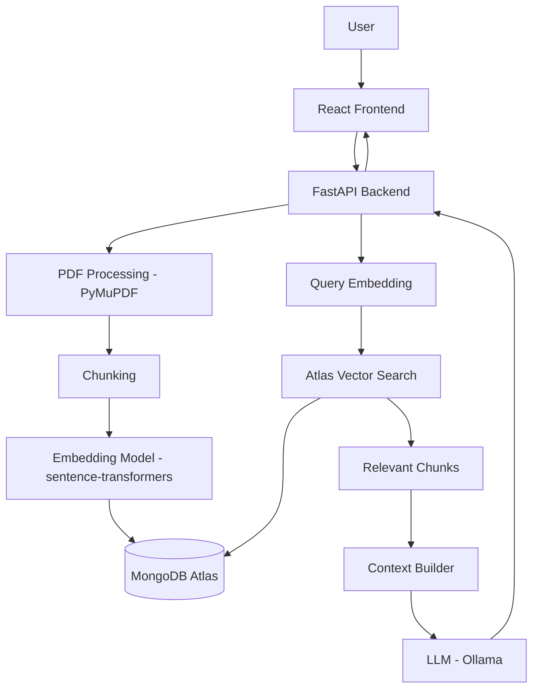

# DocChat

[](https://github.com/sumit6511/docchat/actions/workflows/ci.yml)

Chat with your documents. Get answers grounded in your sources.

DocChat is an AI-powered document Q&A platform: upload PDFs, and ask natural-language
questions about them. Every answer is generated by a real Retrieval-Augmented Generation
(RAG) pipeline — the model only ever sees the passages retrieved from your documents — and
every answer carries the exact page citations it was built from.

---

## Table of Contents

- [Overview](#overview)
- [Features](#features)
- [Architecture](#architecture)
- [How RAG Works](#how-rag-works)
- [Tech Stack](#tech-stack)
- [MongoDB Atlas Vector Search](#mongodb-atlas-vector-search)
- [Project Structure](#project-structure)
- [Local Setup](#local-setup)
- [Docker Setup](#docker-setup)
- [MongoDB Atlas Setup](#mongodb-atlas-setup)
- [Environment Variables](#environment-variables)
- [API Documentation](#api-documentation)
- [Deployment](#deployment)
- [Testing](#testing)
- [Security](#security)
- [Future Improvements](#future-improvements)
- [License](#license)

---

## Overview

Upload a PDF, wait a few seconds for it to be indexed, and start asking questions about it.
DocChat extracts the text, splits it into overlapping chunks, embeds each chunk, and stores
the vectors in MongoDB Atlas. When you ask a question, DocChat embeds the question, runs an
Atlas **`$vectorSearch`** aggregation to find the most relevant chunks, and hands only those
chunks — with document and page metadata — to a local LLM (via Ollama) to generate a grounded
answer. The chunks that were actually used are returned alongside the answer as citations.

## Features

- Drag-and-drop upload of one or more PDFs at once, with live per-file processing status
  (`UPLOADING → PROCESSING → READY/FAILED`)
- Paragraph/sentence-aware chunking with configurable size and overlap
- Batch embedding generation via `sentence-transformers` (local, no external API calls)
- Real semantic retrieval via MongoDB **Atlas Vector Search** — not Python-side cosine similarity
- Per-conversation document scoping, chosen upfront when starting a chat (one document, several,
  or your whole library) and editable at any time afterward
- Suggested starter questions on a fresh conversation
- A configurable minimum relevance threshold so DocChat says "I don't know" instead of guessing
- Source citations (filename, page, relevance score) on every assistant message
- Multiple conversations, renaming, deletion, and conversation history-aware follow-ups
- A basic in-browser PDF viewer that jumps to the cited page
- A debug mode that shows every retrieved chunk and whether it was used
- Clean, typed REST API with OpenAPI docs at `/docs`
- Docker Compose for local development (backend, frontend, Ollama — MongoDB lives in Atlas)

## Architecture



Every stage — extraction, chunking, embeddings, retrieval, context building, and the LLM — is
its own module behind a small interface, so any one of them can be swapped without touching
the others. In particular, `EmbeddingProvider` and `LLMProvider` are abstract interfaces with a
single local implementation each today; adding a hosted provider later is additive, not a
rewrite.

## How RAG Works

```text
Question
   |
   v
Query Embedding                 (rag/embeddings.py -> EmbeddingProvider.embed_query)
   |
   v
MongoDB Atlas $vectorSearch      (db/repositories/chunks.py -> ChunkRepository.vector_search)
   |
   v
Top-K Relevant Chunks            (rag/retrieval.py -> RetrievalService)
   |
   v
Relevance Filtering              (MIN_RELEVANCE_SCORE)
   |
   v
Context Construction             (rag/context.py -> ContextBuilder)
   |
   v
Prompt Assembly                  (rag/prompts.py)
   |
   v
LLM Generation                   (llm/ollama.py -> OllamaProvider)
   |
   v
Answer + Source Citations
```

This whole flow is orchestrated by a single class, `RAGPipeline` (`app/rag/pipeline.py`), which
depends only on interfaces (`RetrievalService`, `ContextBuilder`, `LLMProvider`) — it has no
knowledge of FastAPI, MongoDB connection details, or which embedding/LLM implementation is
actually running. That's what makes it possible to unit test the whole pipeline with fakes (see
[Testing](#testing)) instead of a live database and a live model.

If no retrieved chunk clears `MIN_RELEVANCE_SCORE`, the pipeline **never calls the LLM** — it
returns a fixed "I couldn't find enough information in your documents to answer that question."
response instead. This is a deliberate anti-hallucination guardrail, not a fallback for errors.

No huge context window trick, no sending the whole PDF to the model, and no LangChain — the
pipeline is ~120 lines of plain, readable orchestration code across a handful of files, on
purpose: the point of this project is to demonstrate the mechanics of RAG, not hide them behind
a framework.

## Tech Stack

**Frontend** — React 18, Vite, TypeScript (strict), Tailwind CSS, shadcn/ui-style components
(Radix primitives + `class-variance-authority`), TanStack Query, React Router, React Markdown,
`sonner` for toasts, Vitest + Testing Library.

**Backend** — Python 3.12, FastAPI, Pydantic v2, Motor (async MongoDB driver), PyMuPDF,
`sentence-transformers`, `httpx`, pytest + pytest-asyncio + `mongomock-motor`.

**Database** — MongoDB Atlas, with Atlas Vector Search for retrieval.

**LLM** — Ollama (local, default `llama3.2`), behind a provider interface that also supports
adding hosted providers later.

## MongoDB Atlas Vector Search

Retrieval is a real `$vectorSearch` aggregation against Atlas — see
`backend/app/db/repositories/chunks.py::ChunkRepository.vector_search`:

```javascript
[
  {
    "$vectorSearch": {
      "index": "vector_index",
      "path": "embedding",
      "queryVector": queryEmbedding,
      "numCandidates": 50,
      "limit": 5,
      // present only when a conversation is scoped to specific documents
      "filter": { "document_id": { "$in": [ObjectId("..."), ObjectId("...")] } }
    }
  },
  {
    "$project": {
      "content": 1,
      "document_id": 1,
      "page_number": 1,
      "chunk_index": 1,
      "metadata": 1,
      "score": { "$meta": "vectorSearchScore" }
    }
  }
]
```

Nothing downloads the chunk collection and computes cosine similarity in Python — the ranking
happens inside Atlas. See [MongoDB Atlas Setup](#mongodb-atlas-setup) for how to create the
index this query depends on.

## Project Structure

```text
docchat/
├── .github/workflows/ci.yml         # tests + typecheck + build on every push/PR
├── docker-compose.yml
├── .env.example
├── backend/
│   ├── app/
│   │   ├── main.py                 # FastAPI app, lifespan, CORS, router registration
│   │   ├── config.py                # Settings (env-driven)
│   │   ├── errors.py                # DocChatError hierarchy + JSON error handlers
│   │   ├── api/                     # Thin route handlers
│   │   │   ├── deps.py              # Dependency wiring (repos, services, providers)
│   │   │   ├── health.py
│   │   │   ├── documents.py
│   │   │   └── conversations.py     # conversations + nested messages routes
│   │   ├── db/
│   │   │   ├── client.py            # single app-wide Motor client
│   │   │   ├── indexes.py           # standard (non-Atlas-Search) indexes
│   │   │   └── repositories/        # one repository per collection
│   │   ├── models/                  # internal MongoDB-backed Pydantic models
│   │   ├── schemas/                 # API request/response Pydantic models
│   │   ├── services/                # business logic (upload, ingestion, chat orchestration)
│   │   ├── rag/                     # chunker, embeddings, retrieval, context, prompts, pipeline
│   │   └── llm/                     # LLMProvider interface + OllamaProvider
│   ├── scripts/create_vector_index.py
│   └── tests/
├── frontend/
│   ├── src/
│   │   ├── app/router.tsx
│   │   ├── components/{layout,documents,chat,common,ui}/
│   │   ├── pages/{Dashboard,Chat,Document}.tsx
│   │   ├── api/                     # typed fetch wrappers
│   │   ├── hooks/                   # TanStack Query hooks
│   │   └── types/
│   └── ...
└── storage/documents/               # local PDF storage (bind-mounted into the backend container)
```

## Local Setup

Prerequisites: Python 3.12, Node.js 20+, and [Ollama](https://ollama.com) installed locally (or
use Docker for Ollama — see [Docker Setup](#docker-setup)). You'll also need a MongoDB Atlas
cluster — see [MongoDB Atlas Setup](#mongodb-atlas-setup) — Atlas is required even for local
development; there is no local MongoDB fallback.

```bash
git clone <this-repo>
cd docchat
cp .env.example .env       # fill in MONGODB_URI at minimum
```

**Backend:**

```bash
cd backend
python -m venv .venv
source .venv/bin/activate      # Windows: .venv\Scripts\activate
pip install -r requirements-dev.txt
cp ../.env .env                # or point MONGODB_URI etc. at your shell env directly
uvicorn app.main:app --reload
```

The API is now at `http://localhost:8000`, with interactive docs at `http://localhost:8000/docs`.

**Ollama** (runs on your host either way — see [Docker Setup](#docker-setup)):

```bash
ollama serve                 # usually already running as a service
ollama pull llama3.2          # or whichever OLLAMA_MODEL you configured
```

**Frontend:**

```bash
cd frontend
npm install
cp .env.example .env          # VITE_API_BASE_URL defaults to http://localhost:8000/api
npm run dev
```

The app is now at `http://localhost:5173`.

## Docker Setup

MongoDB lives in Atlas, and **Ollama runs on your host machine**, not in Docker Compose —
install it from [ollama.com](https://ollama.com) and run `ollama serve` there. Only the
frontend and backend run in Docker Compose, and the backend reaches your host's Ollama via
`host.docker.internal` (wired up in `docker-compose.yml`'s `extra_hosts`).

This is a deliberate choice: the official `ollama/ollama` image is ~3.4GB on its own (before
any model weights, which are multi-GB each), and if you already have Ollama installed —
likely, since local model development usually starts there — running a second, separate
instance in Docker just duplicates that download and your model storage for no benefit.

```text
                    Internet
                       |
                       v
                MongoDB Atlas
                +---------------+
                | Documents     |
                | Chunks        |
                | Vectors       |
                | Conversations |
                | Messages      |
                +---------------+
                       ^
                       |
+----------------------+----------------------------+
|                 Local Docker                      |
|                                                   |
|  +-------------+        +--------------+          |
|  |   Frontend  |------->|   Backend    |-----+    |
|  |    React    |        |   FastAPI    |     |    |
|  +-------------+        +--------------+     |    |
|                                              |    |
|  docchat_documents_data volume               |    |
+----------------------------------------------|----+
                                               v
                                        +------------------+
                                        |  Ollama (host)   |
                                        |  localhost:11434 |
                                        +------------------+
```

```bash
cp .env.example .env      # fill in MONGODB_URI
ollama pull llama3.2       # or whichever OLLAMA_MODEL you configure — on the HOST, not in Docker
docker compose up --build
```

This starts:

- `docchat-backend` on `http://localhost:8000`
- `docchat-frontend` on `http://localhost:5173`

Ollama stays wherever it already was — `http://localhost:11434` on your host.

If the configured model isn't pulled yet, `/api/health` will report `"llm": "unavailable"` and
chat requests will return a clean `LLM_UNAVAILABLE` error — the app degrades gracefully rather
than crashing.

Uploaded PDFs persist in the `docchat_documents_data` named volume across restarts.

**Prefer a fully self-contained Docker setup instead?** Add an `ollama` service back to
`docker-compose.yml` (image `ollama/ollama:latest`, port `11434`, a named volume mounted at
`/root/.ollama`), point the backend's `OLLAMA_BASE_URL` at it (`http://ollama:11434`) instead
of `host.docker.internal`, and pull the model into that container with `docker exec -it
<container> ollama pull llama3.2` instead of on the host.

## MongoDB Atlas Setup

Atlas is required — there is no local MongoDB service in this project, by design (see
`docker-compose.yml`).

1. **Create an Atlas account** at [mongodb.com/cloud/atlas](https://www.mongodb.com/cloud/atlas/register).
2. **Create a cluster.** A free M0 cluster works for development and supports Atlas Vector Search.
3. **Create the database.** You don't need to create it explicitly — the first write from the
   app creates `docchat` (or whatever `MONGODB_DATABASE` you set) automatically. If you'd
   rather create it up front: Atlas UI → Database → Browse Collections → Add My Own Data →
   database name `docchat`, collection name `documents`.
4. **Create a database user.** Database Access → Add New Database User. Give it a username and
   password (or use a scoped IAM/OIDC identity) with **Read and write to any database** (or a
   custom role scoped to `docchat`).
5. **Allow your machine's IP.** Network Access → Add IP Address → **Add Current IP Address**
   (or `0.0.0.0/0` for quick local testing only — never do this for a production cluster).
6. **Get your connection string.** Database → Connect → Drivers → copy the `mongodb+srv://...`
   URI, substitute in your database user's username/password, and set it as `MONGODB_URI` in
   `.env`.
7. **Create the Atlas Vector Search index** on `docchat.document_chunks` (see below). This is
   the one manual step Atlas requires beyond a standard collection index — Vector Search
   indexes are managed through Atlas Search, not `createIndex()`.
8. **Start the backend** — it creates the standard (non-Search) indexes automatically on
   startup (`app/db/indexes.py`) and connects using `MONGODB_URI`.
9. **Start the frontend.**

### Creating the Vector Search index

**Option A — Atlas UI:**

Atlas → your cluster → **Search** tab → **Create Search Index** → **Atlas Vector Search** →
**JSON Editor**, database `docchat`, collection `document_chunks`, index name `vector_index`
(must match `VECTOR_INDEX_NAME`), and this definition:

```json
{
  "fields": [
    {
      "type": "vector",
      "path": "embedding",
      "numDimensions": 384,
      "similarity": "cosine"
    },
    {
      "type": "filter",
      "path": "document_id"
    }
  ]
}
```

`numDimensions: 384` matches the default embedding model, `all-MiniLM-L6-v2`. **This number
must equal the output dimension of whatever `EMBEDDING_MODEL` you configure** — if you change
the model, drop and recreate the index with the new dimension. The `filter` field on
`document_id` is what makes per-conversation document scoping possible (see
[Document Filtering](#how-rag-works)) — without it, `$vectorSearch`'s `filter` clause on
`document_id` will be rejected.

**Option B — script:**

```bash
cd backend
python -m scripts.create_vector_index
```

This reads `EMBEDDING_MODEL` from your `.env`, loads it locally to determine its actual output
dimension (so the index is never silently mismatched), and creates the index via PyMongo's
`create_search_index`. It polls until the index reports `queryable: true` (this can take a
minute on a fresh cluster).

Either way, verify the index is ready with `GET /api/health` — `"vector_search": "ok"` means
Atlas has confirmed the index is queryable.

## Environment Variables

See [`.env.example`](.env.example) for the full annotated list. Highlights:

| Variable | Default | Purpose |
|---|---|---|
| `MONGODB_URI` | — (required) | Atlas connection string |
| `MONGODB_DATABASE` | `docchat` | Database name |
| `OLLAMA_BASE_URL` | `http://localhost:11434` | Leave unset in Docker Compose — it defaults to `http://host.docker.internal:11434` there |
| `OLLAMA_MODEL` | `llama3.2` | Must be pulled into your host's Ollama (`ollama pull llama3.2`) before chatting works |
| `EMBEDDING_MODEL` | `all-MiniLM-L6-v2` | Must match the Atlas index's `numDimensions` |
| `TOP_K` | `5` | Chunks returned per query |
| `NUM_CANDIDATES` | `50` | Atlas ANN candidate pool size (should be ≫ `TOP_K`) |
| `MIN_RELEVANCE_SCORE` | `0.50` | Below this cosine score, a chunk is discarded pre-LLM |
| `CHUNK_SIZE` / `CHUNK_OVERLAP` | `800` / `100` | Approximate words per chunk / overlap |
| `MAX_HISTORY_MESSAGES` | `10` | Prior turns included in the prompt |
| `DEBUG_RAG` | `false` | Include retrieved-chunk debug info in message responses |
| `MAX_FILE_SIZE_MB` | `20` | Upload limit |
| `CORS_ORIGINS` | `http://localhost:5173` | Comma-separated; never `*` in production |
| `LOG_FORMAT` | `text` | `json` for structured, one-JSON-object-per-line logs (production/log aggregators) |

The frontend reads one variable, `VITE_API_BASE_URL` (see `frontend/.env.example`).

## API Documentation

Interactive OpenAPI docs are served at `/docs` (Swagger UI) and `/redoc` whenever the backend
is running. Summary of the REST surface (all under `/api`):

```text
GET    /health

GET    /documents
POST   /documents                       multipart/form-data, field name "file"
GET    /documents/{id}
GET    /documents/{id}/file              raw PDF, for the in-app viewer
DELETE /documents/{id}

GET    /conversations
POST   /conversations                    { document_ids?: string[], title?: string }
GET    /conversations/{id}
PATCH  /conversations/{id}                { title?: string, document_ids?: string[] }
DELETE /conversations/{id}

GET    /conversations/{id}/messages
POST   /conversations/{id}/messages       { content: string } -> assistant message + sources
POST   /conversations/{id}/messages/stream  same, streamed as Server-Sent Events (see below)
```

Errors always come back as `{"error": {"code": "...", "message": "..."}}` with an appropriate
HTTP status — see `app/errors.py` for the full set of codes (`NOT_FOUND`, `INVALID_FILE_TYPE`,
`FILE_TOO_LARGE`, `CORRUPTED_FILE`, `VECTOR_SEARCH_FAILED`, `LLM_UNAVAILABLE`, `LLM_TIMEOUT`,
etc.). Stack traces are never sent to the client; unexpected exceptions are logged server-side
and returned as a generic `INTERNAL_ERROR`.

The `/messages/stream` endpoint always responds `200 text/event-stream` (SSE headers are sent
before the RAG pipeline even runs), and emits a sequence of JSON-payload events instead of a
single JSON body: `{"type": "delta", "text": "..."}` for each incremental piece of the answer,
one final `{"type": "done", "message": {...}}` carrying the full persisted message (with
sources), or `{"type": "error", "message": "...", "code": "..."}` if generation fails partway
through — since the HTTP status is already committed to 200 by then, failures surface as this
event rather than as a 4xx/5xx.

## Deployment

DocChat's backend is stateless (aside from local-disk PDF storage — see below), so it deploys
cleanly to any container host.

**Recommended production path:**

```text
Frontend  -> Vercel
Backend   -> Render / Railway / Fly.io
Database  -> MongoDB Atlas
Storage   -> S3-compatible object storage (see below)
LLM       -> a hosted LLM API (see below)
```

**Simpler demo path** (what this repo is configured for out of the box):

```text
Frontend  -> Vercel
Backend   -> Render / Railway / Fly.io
Database  -> MongoDB Atlas
Ollama    -> local development only — do not deploy Ollama to a serverless platform
```

Running Ollama on a typical serverless platform is **not** assumed or supported by this setup —
model weights are multi-GB and inference needs sustained CPU/GPU and disk, which most
serverless platforms don't offer. For a real deployment, either self-host Ollama on a small VM
with a persistent disk, or switch `LLMProvider` to a hosted API.

**Swapping the LLM provider for production:** implement `LLMProvider` (`app/llm/base.py`) —
one `generate(system_prompt, user_prompt) -> str` method — against OpenAI, Anthropic, Gemini, or
any other hosted API, and wire it into `app/api/deps.py::get_llm_provider`. Nothing in
`RAGPipeline`, retrieval, or the API layer needs to change.

**Object storage for production:** `LocalFileStorage` (`app/services/file_storage.py`) writes
PDFs to local disk, which is fine for a demo but **is not durable** on most PaaS platforms
(ephemeral filesystems) and doesn't scale past one instance. Implement `FileStorage`'s three
methods (`save`/`get`/`delete`) against S3, R2, GCS, or Azure Blob and swap it in via
`get_file_storage` — `DocumentService` and the upload/download routes are unaffected.

**CORS:** set `CORS_ORIGINS` to your deployed frontend's exact origin (comma-separated for
multiple). Never deploy with `allow_origins=["*"]`.

## Testing

Every push and pull request runs backend tests, frontend typecheck/tests/build, and a
`docker-compose.yml` validation via GitHub Actions (`.github/workflows/ci.yml`) — see the badge
at the top of this README, or the [Actions tab](https://github.com/sumit6511/docchat/actions).

**Backend:**

```bash
cd backend
pip install -r requirements-dev.txt
pytest
```

No test requires a live MongoDB Atlas cluster, a live Ollama instance, or a downloaded
sentence-transformers model beyond what the API-layer tests need for their fake embedding
provider (which is a deterministic pure-Python stand-in, not the real model). Coverage:

- `test_chunker.py` — empty input, short text, long paragraphs crossing chunk boundaries,
  overlap behavior, deterministic output, single sentences longer than the chunk budget
- `test_pdf_processing.py` — text extraction and page-number metadata via real (generated)
  PDFs, corrupted/unreadable file handling
- `test_retrieval.py` — query embedding, `top_k`/`num_candidates` forwarding, document-id
  filtering, relevance-threshold filtering — against a fake `ChunkRepository`, since
  `$vectorSearch` only exists on a real Atlas cluster
- `test_chat_pipeline.py` — context construction and deduplication, prompt assembly, source
  preservation, and the critical no-relevant-context path (LLM is never called)
- `test_api.py` — health endpoint, upload validation (type/size/corruption), listing,
  conversation CRUD, message creation with a faked RAG pipeline, 404s on bad ids

**Frontend:**

```bash
cd frontend
npm install
npm test
```

Covers the upload dropzone's client-side validation (including multi-file selection), status
badges (verifying each state has distinct visible text, not just a color), message rendering
(markdown, user vs. assistant, citations present/absent), source cards, and empty states — plus
the TanStack Query hooks themselves (`useDocuments`, `useConversations`): query data, cache
invalidation on each mutation, the document-list polling logic, and per-file upload behavior
(including a concurrency bug this test suite caught — see `useDocuments.ts`'s
`useMultiFileUpload` for the fix).

## Security

- Uploads are validated by extension, declared MIME type, size, and actual PDF readability
  (opened with PyMuPDF) before anything is written to disk.
- Filenames are never trusted as filesystem paths — a random UUID-based name is used for
  storage, and the display filename is sanitized separately (`services/file_storage.py`).
- Secrets live in environment variables and `.env` is git-ignored; only `.env.example` is
  committed.
- CORS is environment-driven and must be an explicit origin list in production.
- Errors returned to clients never include stack traces or server filesystem paths; document
  contents and full prompts are never written to logs (see `app/logging_config.py`).
- **Authentication is out of scope for v1** — the app assumes a single local user. It's not
  faked, either: there's no login screen pretending to gate anything. Before exposing this to
  multiple untrusted users, add real authentication and thread a `user_id` through the document
  and conversation models (both already have room for it).

## Future Improvements

- Authentication and per-user document isolation
- S3/R2 object storage backend for uploaded PDFs
- OCR for scanned/image-only PDFs
- DOCX / TXT / Markdown ingestion
- Hybrid (vector + full-text) search, and cross-encoder reranking
- Hosted LLM providers (OpenAI/Anthropic/Gemini) as drop-in `LLMProvider` implementations
- Document collections / folders, team collaboration, shareable conversation links
- Inline citation highlighting in the PDF viewer
- Usage analytics

## License

MIT — see [LICENSE](LICENSE).
